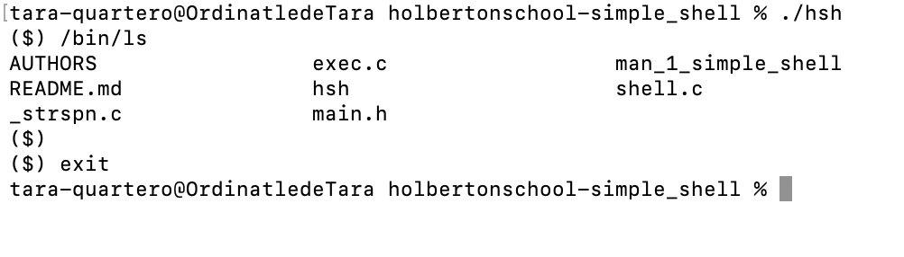
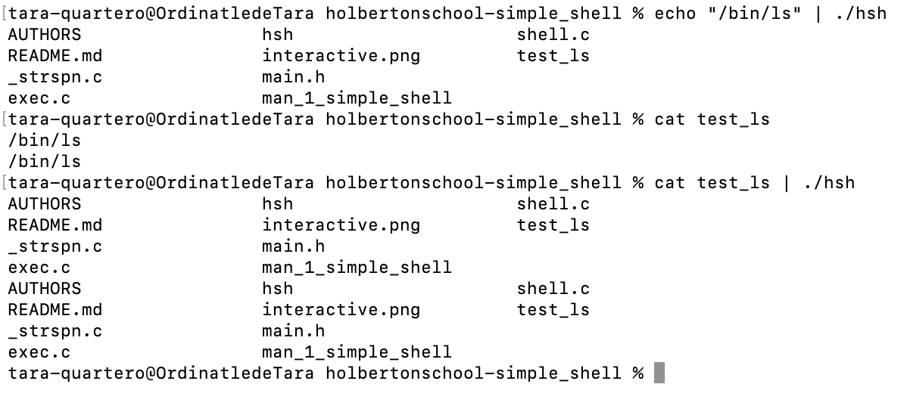

# README file for the TEAM project Simple Shell :busts_in_silhouette: :ledger:

We are Tara and Xavier, students from the campus of Holberton in Fréjus.

## Description of this project :spiral_notepad: :

In this project it is requested to reproduce a simplified version of the shell. This should work in the terminal to allow typing a command and running it, such as ls or cat + name of file. It should be possible to exit the shell with specific commands like exit.

## :hammer_and_wrench: Requirements of this project :

Here are some main requirements we need to respect while working on this project together :

### :star: General requirements :

- A README.md file, at the root of the folder of the project is mandatory
- Your code should use the Betty style. It will be checked using betty-style.pl and betty-doc.pl
- Your shell should not have any memory leaks
- No more than 5 functions per file
- All your header files should be include guarded
- Use system calls only when you need to.
- Only some system calls and functions are allowed. (Listed below in the dedicated section)
- All your files will be compiled on Ubuntu 20.04 LTS using gcc, using the options -Wall -Werror -Wextra -pedantic -std=gnu89

### :star: About Github :

- There should be one project repository per group.

### Allowed functions and system calls :

Here is the liste of the allowed system calls and functions for this project.

all functions from string.h
access (man 2 access)
chdir (man 2 chdir)
close (man 2 close)
closedir (man 3 closedir)
execve (man 2 execve)
exit (man 3 exit)
_exit (man 2 _exit)
fflush (man 3 fflush)
fork (man 2 fork)
free (man 3 free)
getcwd (man 3 getcwd)
getline (man 3 getline)
getpid (man 2 getpid)
isatty (man 3 isatty)
kill (man 2 kill)
malloc (man 3 malloc)
open (man 2 open)
opendir (man 3 opendir)
perror (man 3 perror)
printf (man 3 printf)
fprintf (man 3 fprintf)
vfprintf (man 3 vfprintf)
sprintf (man 3 sprintf)
putchar (man 3 putchar)
read (man 2 read)
readdir (man 3 readdir)
signal (man 2 signal)
stat (__xstat) (man 2 stat)
lstat (__lxstat) (man 2 lstat)
fstat (__fxstat) (man 2 fstat)
strtok (man 3 strtok)
wait (man 2 wait)
waitpid (man 2 waitpid)
wait3 (man 2 wait3)
wait4 (man 2 wait4)
write (man 2 write)

## :rocket:  How to clone, compile and execute our shell :

### :small_orange_diamond: How to clone this repo ?

If you want to give a try to our project, you are very welcome to clone this repo on your computer, using the command git clone and the link in your terminal.

### :small_orange_diamond: How to  compile ?

You can compile this program using this command :

	gcc -Wall -Werror -Wextra -pedantic -std=gnu89 *.c -o hsh

### :small_orange_diamond: How to execute the program ?

If you want to test our program, you can simply compile and then execute our program with a command like this one :

	/bin/ls

### :small_orange_diamond: How to exit the simple shell program :

Once you tested our program you probably will be looking for the command to use in order to quit the program :

- use control + C
- or exit
- or ctrl + D

### :small_orange_diamond: How to check for memory leaks ? :thinking:

	valgrind + name of the file

## :small_orange_diamond: What will this program return ? 

The program returns 0 on success, or another value on error.

## :small_blue_diamond: How to use the man page of the Simple Shell project ?

In order to read the man page of this project, please use the command below :

	man ./man_1_simple_shell

## Exemples (interactive or not) :

### Interactive example :

### Non interactive example :

## :busts_in_silhouette:  About the authors :

### :woman_technologist: Meet Tara :

- :blue_square: LinkedIn : [Access to this account](https://www.linkedin.com/in/tara-alexandra-quartero-a34534177/)

### :computer: Meet Xavier :

- :blue_square: LinkedIn : [Access to this account](https://www.linkedin.com/in/xavier-sanchez-b09b71311/)

